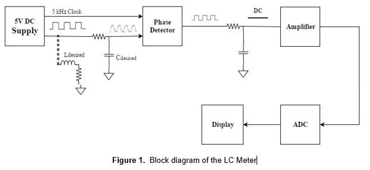
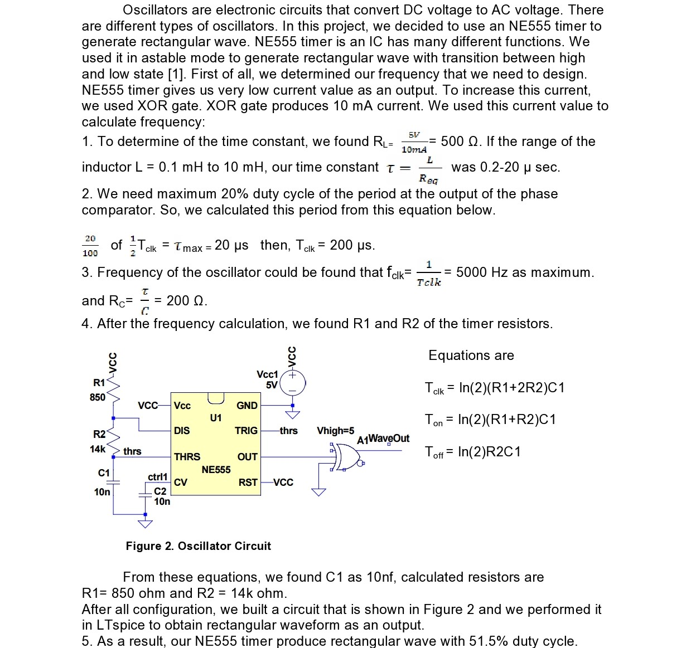
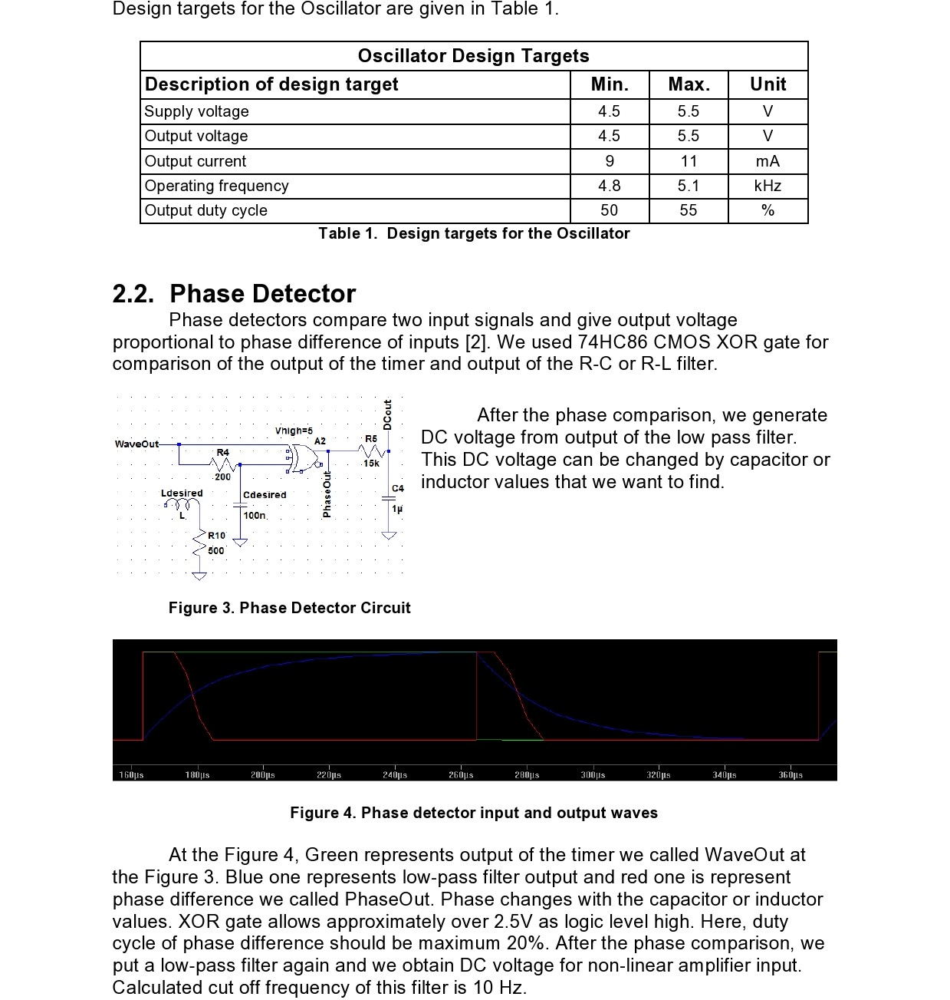
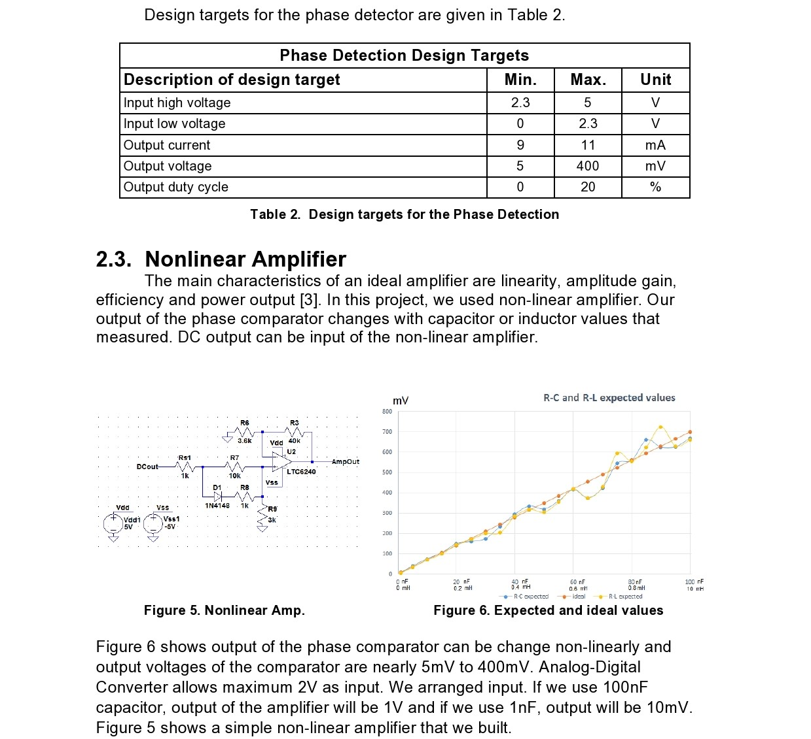
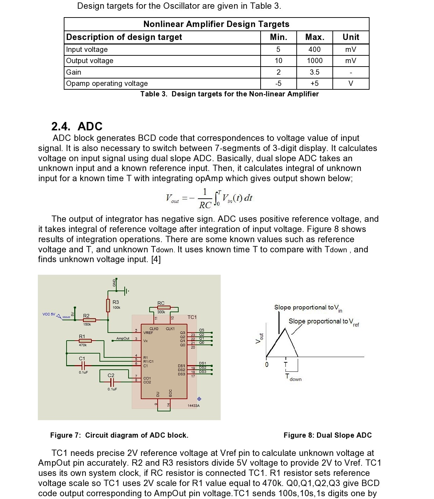
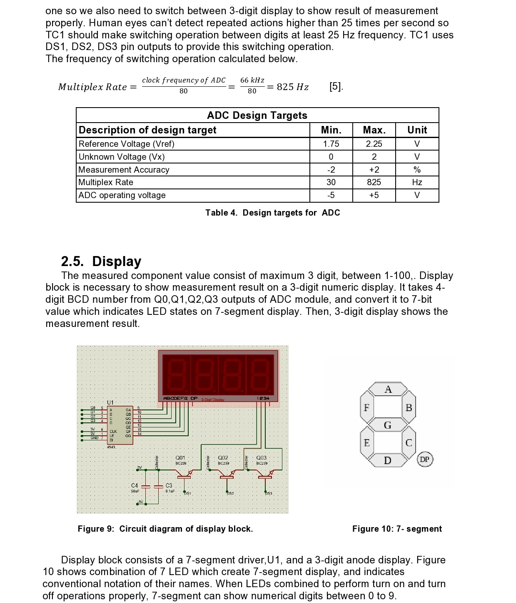
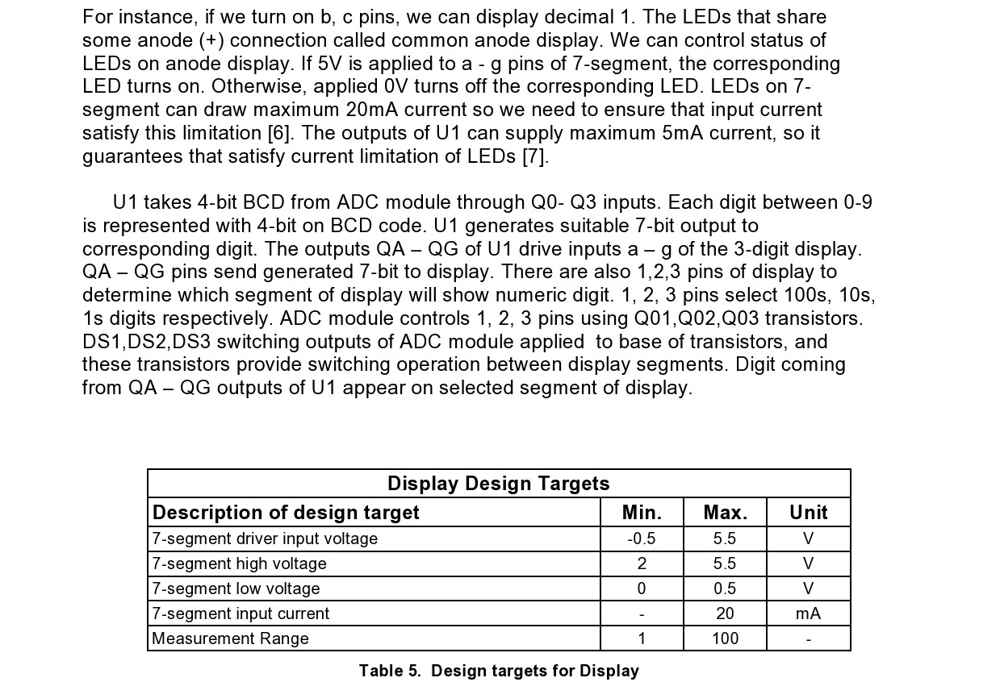
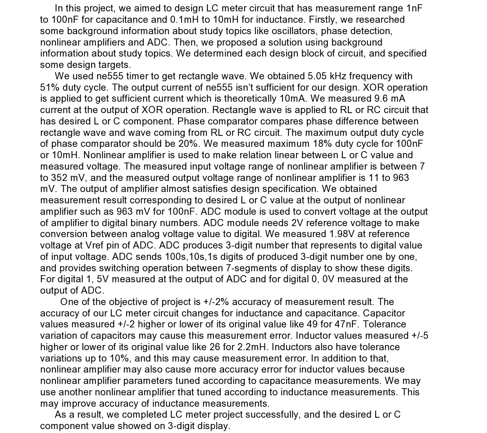

# Capacitance-Inductance_Measurement_Circuit

## Objective
In the laboratory, there are some color codes to determine resistor and inductor values but sometimes we need accurate values in applications. We use multimeter to measure DC voltages, currents and resistor values. However, we     cannot measure inductor and capacitor values with multimeter. LC meter is a useful device to use in the laboratory. It determines inductor and capacitor values. In this project, we will construct LC meter circuits. Its measurement range will be 1nF to 100nF for capacitance and 0.1mH to 10mH for inductance with +/-2% accuracy. 

## Technical Description

The 3-digit display should show L or C value of connected component with +/-2% accuracy. An oscillator generates a rectangle pulse. This pulse goes to a low pass filter which consist of desired inductor or capacitor and resistor. The output of filter has phase delay due to time delay of basic R-C and L-R circuits. Phase detector compares delayed pulse with clock pulse, and detect phase difference between them. Duty cycle of phase detector output is proportional to phase difference due to delayed pulse.

A low pass filter takes DC average of the pulse that contains phase difference. DC voltage represents phase difference. There is a nonlinear amplifier to make relation linear between measured L or C value with DC voltage. ADC converts DC voltage to digital value, and generate 4-bit BCD (binary coded decimal) code that corresponds decimal value of DC voltage. ADC also provide switching operation between 3 seven segment display that is driven by 7-segment driver. 7-segment driver decodes 4-bit BCD to 7-bit value, and 3-digit display shows corresponding digit number to this 7-bit value.   

## 2.1. Oscillators

## Conclusion

## References
1. http://ehelion.net/projects/digitalclock/555timer.html

1. https://en.wikipedia.org/wiki/Phase_detector#Phase-frequency_detector

1. http://whatis.techtarget.com/definition/nonlinearity

1. http://www.asdlib.org/onlineArticles/elabware/Scheeline_ADC/ADC_ADC_Dual_Slope.html

1. http://www.mouser.com/ds/2/268/21394b-72903.pdf    

1. http://www.electronics-tutorials.ws/blog/7-segment-display-tutorial.html

1. http://www.ti.com/lit/ds/symlink/cd4543b.pdf  

